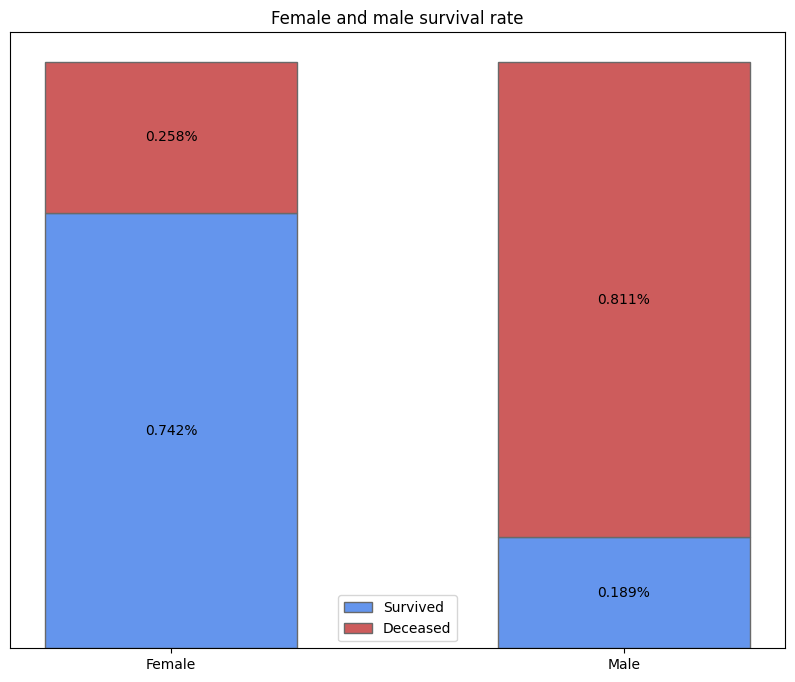
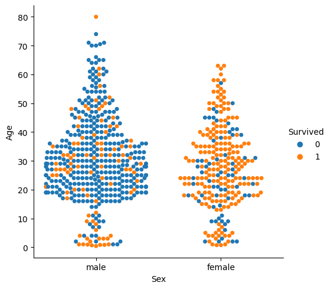
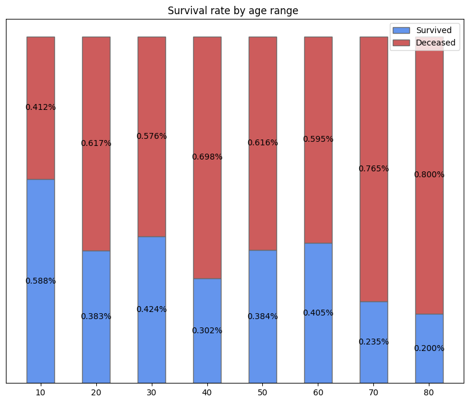

# Titanic - Machine Learning from Disaster

Using the dataset provided by Kaggle, a machine learning model was developed to predict whether a person would survive the disaster or not.

## Data

In this section, we'll start by taking a look at the initial dataset provided by Kaggle, which contains valuable information about the passengers on the Titanic.

|   PassengerId |   Survived |   Pclass | Name                                                | Sex    |   Age |   SibSp |   Parch | Ticket           |    Fare | Cabin   | Embarked   |
|--------------:|-----------:|---------:|:----------------------------------------------------|:-------|------:|--------:|--------:|:-----------------|--------:|:--------|:-----------|
|             1 |          0 |        3 | Braund, Mr. Owen Harris                             | male   |    22 |       1 |       0 | A/5 21171        |  7.25   | nan     | S          |
|             2 |          1 |        1 | Cumings, Mrs. John Bradley (Florence Briggs Thayer) | female |    38 |       1 |       0 | PC 17599         | 71.2833 | C85     | C          |
|             3 |          1 |        3 | Heikkinen, Miss. Laina                              | female |    26 |       0 |       0 | STON/O2. 3101282 |  7.925  | nan     | S          |
|             4 |          1 |        1 | Futrelle, Mrs. Jacques Heath (Lily May Peel)        | female |    35 |       1 |       0 | 113803           | 53.1    | C123    | S          |
|             5 |          0 |        3 | Allen, Mr. William Henry                            | male   |    35 |       0 |       0 | 373450           |  8.05   | nan     | S          |

We can also look if there's any empty data:

| Column       | Non-Null Count | Dtype   |
|--------------|----------------|---------|
| PassengerId  | 891            | int64   |
| Survived     | 891            | int64   |
| Pclass       | 891            | int64   |
| Name         | 891            | object  |
| Sex          | 891            | object  |
| Age          | 714            | float64 |
| SibSp        | 891            | int64   |
| Parch        | 891            | int64   |
| Ticket       | 891            | object  |
| Fare         | 891            | float64 |
| Cabin        | 204            | object  |
| Embarked     | 889            | object  |

The **Age**, **Cabin**, and **Embarked** columns contain missing values. We will address this by taking the following steps: 

1. We will drop the **Cabin** column due to the extensive amount of missing data.
2. For the **Embarked** column, we will simply remove the few entries where the data is null.
3. To handle missing values in the **Age** column, we will replace them with the mean age based on the passenger's gender. Notably, male passengers will be divided into two groups: one for those whose name contains the title *Master*, and another for all other male passengers.

We will also split the categorical features - **Sex** and **Embarked** - into other columns, using OneHotEncoding.

After those initial transformations, we can start looking for relations between the columns.

**1. Female Survival Rate:**
    

**2. Survival Distribution by Sex and Age:**

   

**3. Survival Rate by Age Range:**

   

It seems that gender is a big factor to determine wether a passenger would survive or not the disaster. Looking at the 2º plot, we can also see a high rate of survival among males aged 0-5. Those relationships could be a result of the time that the disaster took place, where the concept "women and children first" was widely used.

We can further look for correlations using a correlation matrix:

| Variable     | Correlation |
|--------------|-------------|
| survived     | 1.000000    |
| sex_female   | 0.543351    |
| pclass_1     | 0.285904    |
| fare         | 0.257307    |
| embarked_C   | 0.168240    |
| pclass_2     | 0.093349    |
| parch        | 0.081629    |
| embarked_Q   | 0.003650    |
| sibsp        | -0.035322   |
| age          | -0.094318   |
| embarked_S   | -0.149683   |
| pclass_3     | -0.322308   |
| sex_male     | -0.543351   |

The passenger class and fare also seems to play a big part for the passenger's survival.

## Feature Engineering

In the process of feature engineering, new columns were introduced based on the titles extracted from passenger names, allowing the grouping of individuals according to their respective titles. Less common titles were aggregated based on gender to maintain data integrity and relevance.

Additionally, the decision was made to remove the sex column, as the newly created title columns effectively serve as a replacement, providing more detailed information.

Furthermore, the **sbsp** (number of siblings/spouses) and **parch** (number of parents/children) columns were consolidated into a single column, streamlining the dataset for analysis.

## Models

During the initial testing phase, the following machine learning models were assessed:

- K-Nearest Neighbors (KNN)
- Random Forest
- Decision Tree
- Linear Support Vector Classification (LinearSVC)

Among these models, Decision Tree and Random Forest were chosen without fine-tuning due to their superior accuracy during cross-validation. 

In an initial exploration using Randomized Search, the Random Forest model demonstrated its superiority in solving the problem compared to the Decision Tree. Consequently, a Grid Search was employed to obtain optimal parameters for the Random Forest.

The trained model was saved using the joblib library and can be accessed [here](kaggle_rf.joblib), with the generated predictions available in [this file](kaggle_submission.csv). It's important to note that the model provided was trained with the data **before** feature engineering was conducted. After further testing with the new training data, no improvement was detected. The provided model achieved a score of 0.77511.

